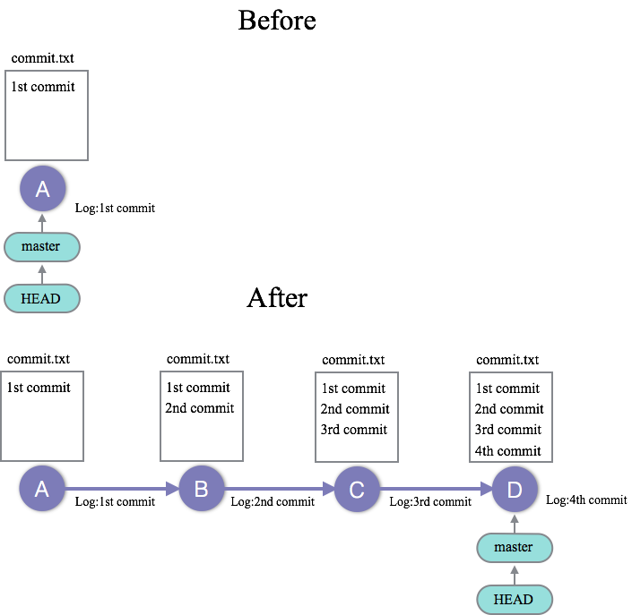

01_commit_3x : コミットを3回実施する
========

### 問題
--------------------
今、01_commit_3xのgitレポジトリはBeforeの状態である。  
コミットを3回行うことで、gitレポジトリをAfterの状態にせよ。

### 解答
--------------------
[01_commit_3xの解答](./01_commit_3x_answer.md)

### Link
--------------------
 * Next: [02_amend_commit_log : 直近のコミット、コミットログを修正する問題](02_amend_commit_log.md)
 * 目次: [README](README.md)
