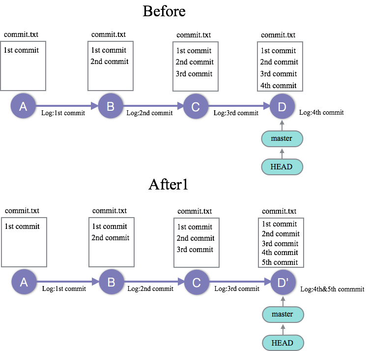
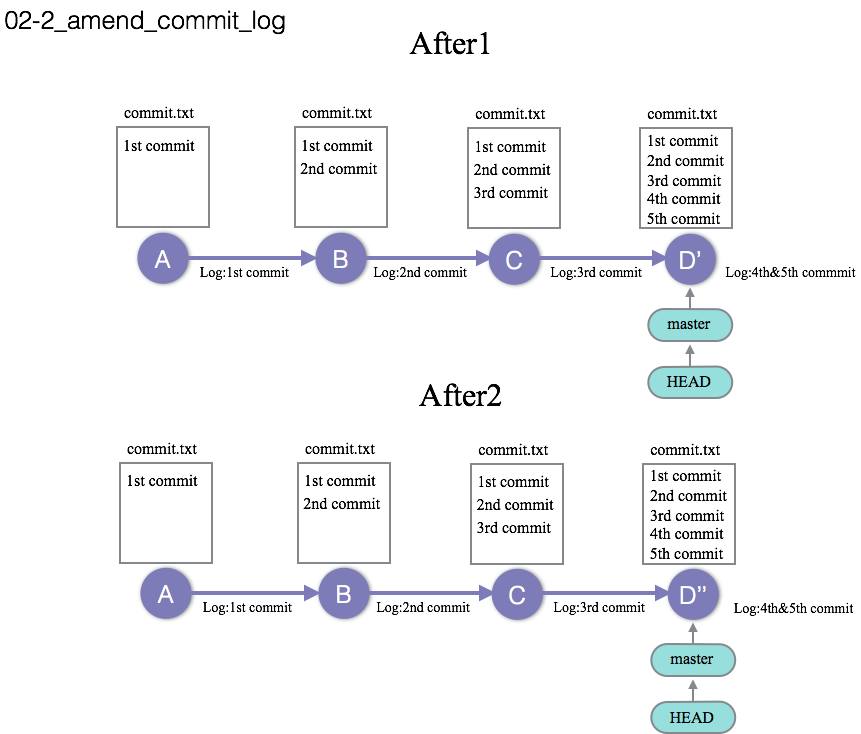

02_amend_commit_log : 直近のコミット、コミットログを修正する
========

### 問題2-1
--------------------
今、02_amend_commit_logのgitレポジトリはBeforeの状態である。  
しかし、commit.txtの最後に`5th commit`の文字列を追記し忘れてしまった。  

commit.txtに5th commitの文字列を追加し、直近のコミットに変更分を追加することで、  
02_amend_commit_logのgitレポジトリをAfter1の状態にせよ。
この時、コミットログコメントは`4th & 5th commmit`とする。 

### 問題2-2
--------------------
無事修正が終わったと思いきや、コミットログコメントにtypoがあった。  
このままだと格好が悪いので、`4&5th commmit` を`4&5th commit`に修正したい。
02_amend_commit_logのgitレポジトリをAfter1からAfter2の状態に修正せよ。

### 解答
--------------------

[問題2−1の解答](02_amend_commit_log_answer.md#ans2-1)  
[問題2−2の解答](02_amend_commit_log_answer.md#ans2-2)  

### Link
--------------------
 * Previous: [01_commit_3x : コミットを3回実施する問題](01_commit_3x.md)  
 * Next: [03_clean_up_commit : 過去のコミットをまとめて修正する、綺麗にまとめる](03_clean_up_commit.md)
 * 目次: [README](README.md)
 
