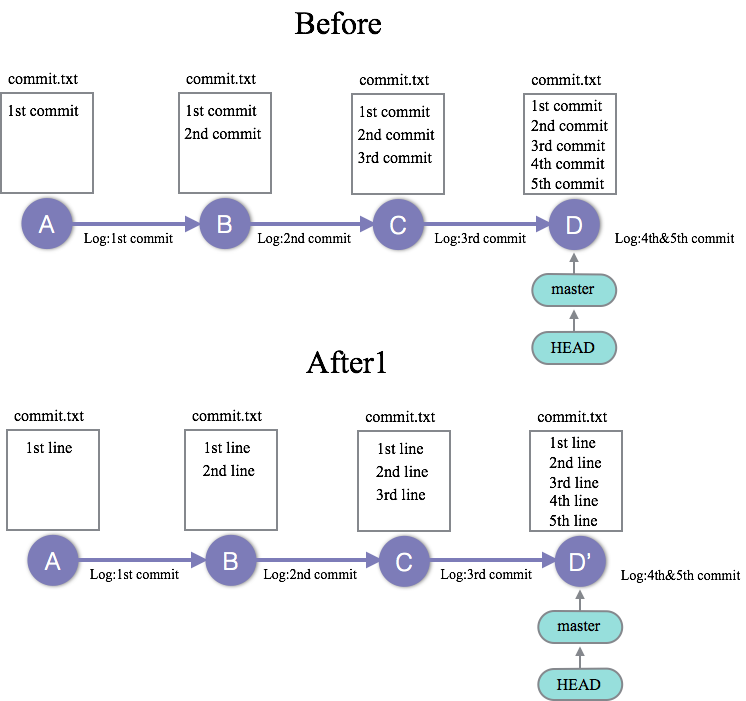
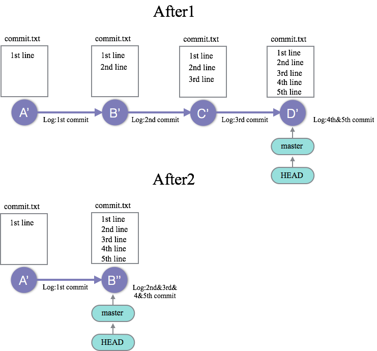

03_clean_up_commit : 過去のコミットをまとめて修正する、綺麗にまとめる
========

### 問題3-1
--------------------
今、03_clean_up_commitのgitレポジトリはBeforeの状態である。  
しかし、commit.txtの文字列は本来`XX line`にする予定だったが、誤って`XX commit`にしていることに後日気がついた。
03_clean_up_commitのgitレポジトリをAfter1の状態にして、当初の予定通りの文字列をcommit.txtに記載せよ。

### 問題3-2
--------------------
無事After1の状態にgitレポジトリを変更する事ができたが、まめにコミットをしすぎたためコミットログが汚くなってしまった。そこで、B',C',D'のコミットを1つにまとめることにした。03_clean_up_commitのgitレポジトリをAfter1からAfter2の状態にせよ。

### 解答
--------------------

[問題3−1の解答](03_clean_up_commit_answer.md#ans3-1)  
[問題3−2の解答](03_clean_up_commit_answer.md#ans3-2)  

### Link
--------------------
 * Previous: [02_amend_commit_log : 直近のコミット、コミットログを修正する問題](02_amend_commit_log.md)
 * Next: [04_handle_branch : ブランチを使いこなす](04_handle_branch.md) 
 * 目次: [README](README.md)
 