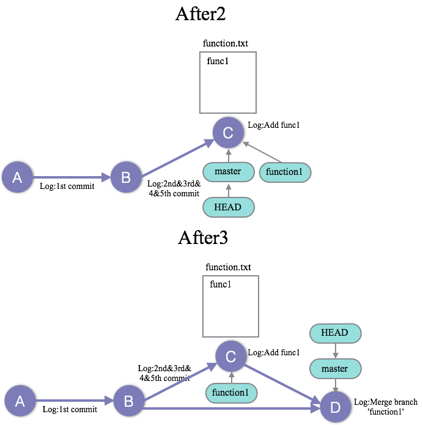
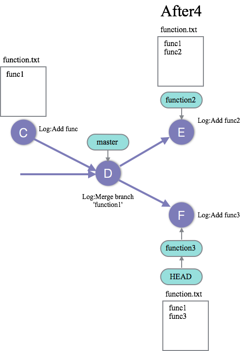
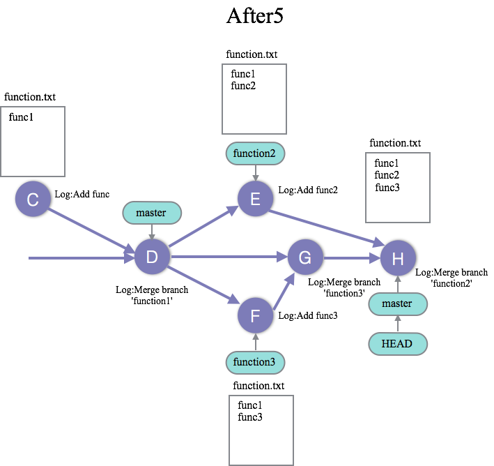
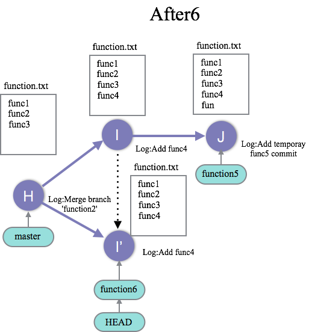
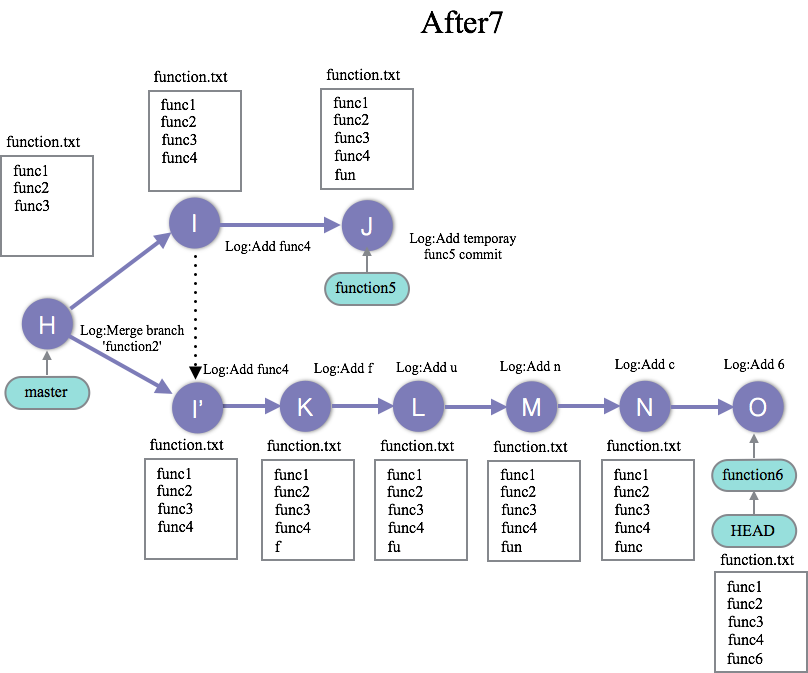
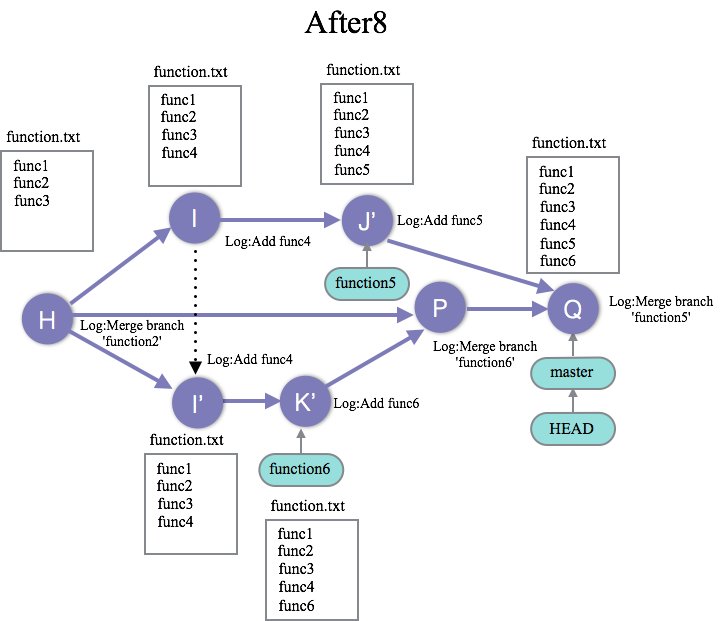

04_handle_branch : ブランチを使いこなす
========

### 問題4-1
--------------------
#### シナリオ
あるサービスの新機能の開発のために、masterブランチからfunction１ブランチを切り、
function.txtにfunc1を追記することになった。
#### 問題
04_handle_branchのgitレポジトリの状態をBeforeからAfter1に変更せよ。  
  
  

### 問題4-2
--------------------
#### シナリオ
function1での新機能の開発が完了したため、masterブランチに変更を反映させたい。
04_handle_branchのgitレポジトリの状態をAfter1からAfter2に変更せよ。
また、After2のコミットログからだと他の開発メンバーがmasterブランチにfunction1ブランチを取り込んだのを判断しにくいと考えたため、After3の状態にすることにした。
#### 問題
After2の状態からコミットを遡り、After3の状態に変更せよ。
また、After3の状態になったことを確認したら、必要なくなったfunction1ブランチは削除すること。

### 問題4-3
--------------------
#### シナリオ
新機能function2の開発を行うことになった。そこで、function2のブランチを切り`function.txt`で`func2`の開発を始めた。しかし、しばらくすると、function2より新機能function3の開発を先に完了し、サービスに統合して欲しいとの依頼が来た。
#### 問題
そこで、function3のブランチを切り、それぞれ`function.txt`に`func3`を追加することにした。
04_handle_branchのgitレポジトリの状態をAfter3からAfter4に変更せよ。 

### 問題4−4 
-------------------
#### シナリオ
無事にfunction3の開発を完了したので、masterブランチにfunction3ブランチをマージした。その後、function2の開発も完了したので、masterブランチにマージしようとしたところ直前にマージしたfunction3とfunction.txt上でコンフリクトした。吟味した結果、function.txtではfunction2を先に記述するべきだと判断したので、func2,func3の順でfunction.txtに記載することでコンフリクトを解消することにした。
#### 問題
04_handle_branchのgitレポジトリの状態をAfter4からAfter5に変更せよ。 

### 問題4-5
-------------------
#### シナリオ
次にfunction4,function5を開発することになった。fucntion4はfunction5で利用する機能なのでfunction5ブランチを切りそこで両方の開発を進めることにした。function5ブランチでfunction4の開発が終わり、function5の開発をしていると、異なる機能function6を開発して今すぐmasterブランチに統合して欲しいという依頼が来た。そこで、function5の作業内容を一時的にコミットして、funtion6ブランチを切りfunction6を開発することにした。しかし、function6もfunction4が必要であることがわかった。そこで、function5ブランチで作成したfunction4のコミットをfucntion6ブランチに持ってくることにした。
#### 問題
04_handle_branchのgitレポジトリの状態をAfter5からAfter6に変更せよ。 

### 問題4-6 
--------------------
#### シナリオ
function6の実装が困難だったため、途中経過を残すために`function.txt`に`f`,`u`,`n`,`c`,`6`をそれぞれ追記するごとにコミットログを残すことにした。`6`を追記した所で無事function6の実装が完了したがコミットログが汚くなってしまった。そこで、fucntion6の実装で残したコミットログを1つにまとてmasterブランチに統合した。function5の開発は次のコミットで完了したので、一時的コミットと1つにまとめてmasterブランチにマージした。

#### 問題
04_handle_branchのgitレポジトリの状態をAfter6からAfter7、After7からAfter8に変更せよ。  

### 解答
--------------------

[問題4−1の解答](04_handle_branch_answer.md#ans4-1)  
[問題4−2の解答](04_handle_branch_answer.md#ans4-2)  
[問題4−3の解答](04_handle_branch_answer.md#ans4-3)  
[問題4−4の解答](04_handle_branch_answer.md#ans4-4)   
[問題4−5の解答](04_handle_branch_answer.md#ans4-5)   
[問題4−6の解答](04_handle_branch_answer.md#ans4-6)
  
### Link
--------------------
 * Previous: [03_clean_up_commit : 過去のコミットをまとめて修正する、綺麗にまとめる](03_clean_up_commit.md)
  * Next: 
 * 目次: [README](README.md)
 